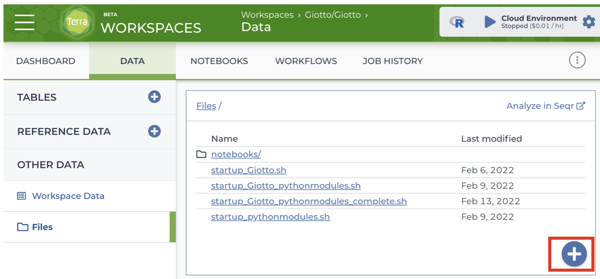
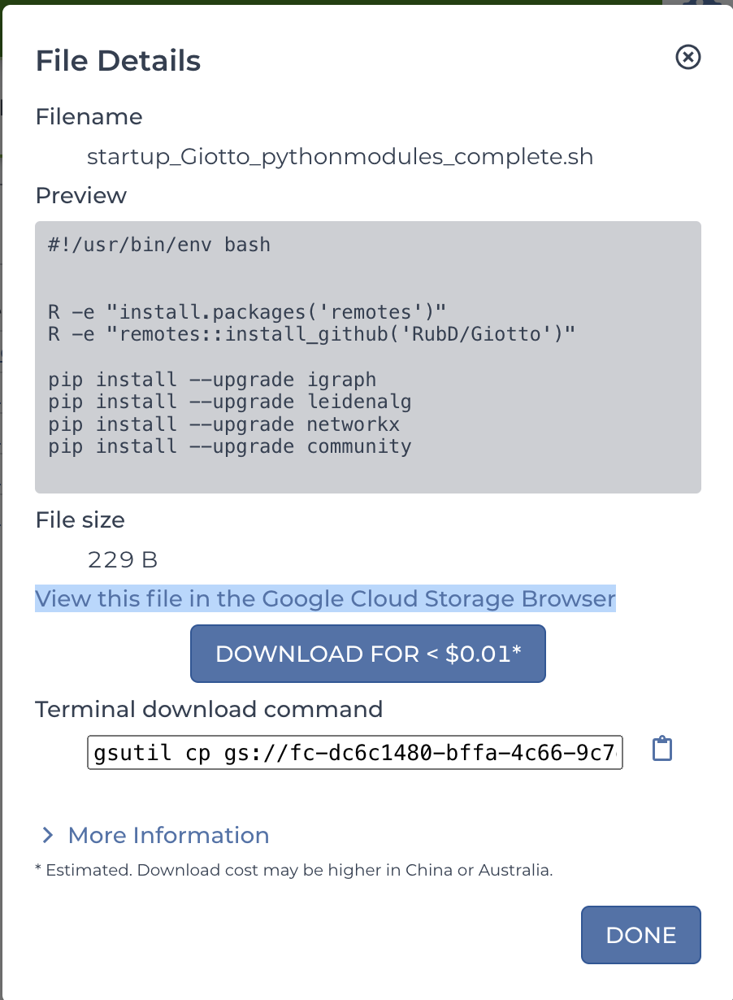
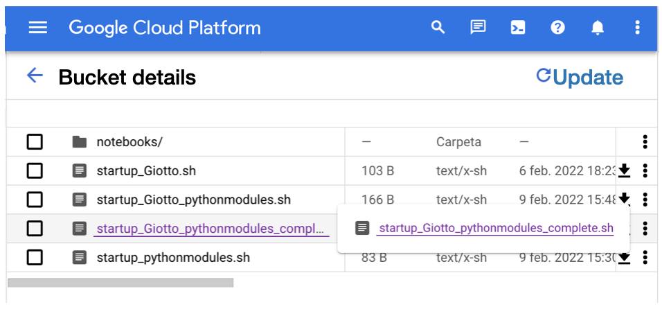
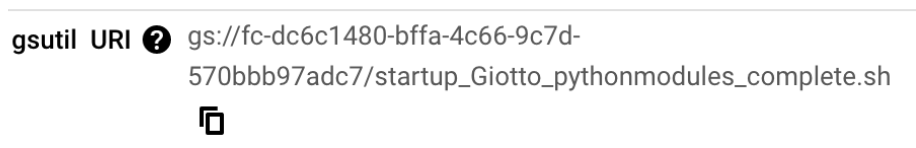
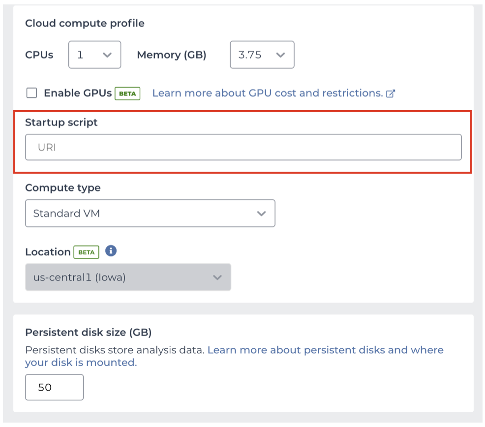

# Launching Giotto on the Cloud

You can run all your pipelines using Giotto on the Cloud through Terra platform.

## Setting up your Terra account

Go to <https://app.terra.bio/> on Chrome browser and Sign up using your email.


## Creating a billing account

- Create an account on the Google Cloud Platform.
- Set Terra as a billing user on your account.
- Select your Google account to create your billing project on Terra.

For additional information about billing account go to the [Link](https://support.terra.bio/hc/en-us/articles/360048632271-Understanding-Terra-costs-and-billing).

## Create a workspace

- Create a workspace within your billing account. Note that all users with access permissions to your workspace will be sharing the same billing account.
- Launch a Virtual Machine with a Cloud environment.


## Create a Cloud Environment

In Terra, you can run Cloud Environments using Jupyter notebooks or the RStudio App. We recommend to your either the Juypyter notebook + Python + Bioconductor or RStudio + Bioconductor options. 

```{r,echo=FALSE}
knitr::include_graphics("img/01_environments.png")
```

You can customize the memory usage, the number of CPUs, and the persistent disk size for your virtual machine.

```{r,echo=FALSE}
knitr::include_graphics("img/01_vm.png")
```

Once you launched either a Jupyter notebook or the RStudio App, you can install the Giotto package using `remotes::install_github("RubD/Giotto")`.

If your prefer to launch a virtual machine ready to use, you can use our Terra-based Docker image, or the [Giotto's startup script](https://github.com/josschavezf/giotto_cloud/blob/main/startup_script.sh).


## Customizing your Cloud Environment using a Giotto's Docker image

Under Application configuration, use the option Custom Environment and introduce the link to Docker container, named josschavezf/terra-jupyter-bioconductor-giotto:latest

```{r,echo=FALSE}
knitr::include_graphics("img/02_docker.png")
```

## Customizing your Cloud Environment using a Startup Script

You can download the Startup Script from this [link](https://github.com/josschavezf/giotto_cloud/blob/main/startup_script.sh)

- Upload the Startup Script to your Workspace Files.

```{r,echo=FALSE}

```

- Click on the startup_script.sh document and select "View this file in the Google Cloud Storage Browser " this option will re-direct you to your Google Cloud documents page

```{r,echo=FALSE}

```

- Click on the startup_script.sh document to display the file details. Copy the link

```{r,echo=FALSE}


```

- Use this link to launch the Cloud environment under the Startup Script option

```{r,echo=FALSE}

```

- Click on Create Environment


## Share your workspace with collaborators

You can share your workspace with collaborators, including data, notebooks, and workflows stored in your workspace.

- Go to the Dashboard tab on your workspace and click the three dots on the upper right corner.
- Select Share option.
- Add the email of your collaborator. They will receive an invitation for joining the worskpace.
- You can select which permissions are granted to your collaborator (reader, writer or owner).
- Click the save button.

```{r,echo=FALSE}
knitr::include_graphics("img/04_share.png")
```

Some considerations when sharing with collaborators in Terra:

- Keep in mind that all Cloud environments (virtual machines) launched within the same workspace are linked to the same billing account.
- Simultaneous modification of notebooks are not allowed.
- Opening the notebook while someone else is editing will show a message, but the current editor is not notified when someone else is trying to open the notebook.


